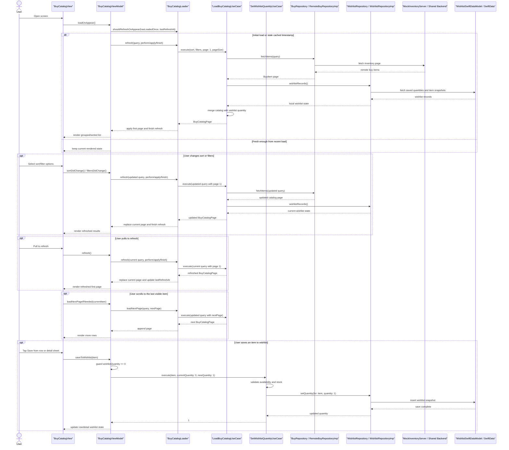

# To Buy Module Features

## Purpose

Display a list of items to buy from a remote API and allow users to save items into a local wishlist.

This document combines both the feature overview and the main design decisions behind the `To Buy` implementation.

## Core Features

- Remote API-backed item list
- Sorting
- Item detail page
- Paged item loading
- Wishlist stored locally
- Add available items to wishlist
- Server can return items as out of stock or removed from catalog

## Item Data

Each buy item can include:

- Title
- Detail/description
- Price
- Category
- Wishlist quantity
- Availability state

Current availability states:

- Available
- Out of stock
- Removed from catalog

## User Experience

- Load items on screen open
- Load items page-by-page
- Load the next page automatically as the user scrolls
- Sort by title
- Sort by price ascending
- Sort by price descending
- Filter by availability
- Filter by category
- Always group displayed items by availability before applying the selected sort:
- Available items first
- Out of stock items next
- Removed from catalog items last
- Open a detail page for each item
- Save available items into the wishlist from the catalog
- Reflect server-provided availability states clearly
- Surface loading and error states

Current active behavior:

- Remote items are fetched with `BuyCatalogQuery`
- `BuyCatalogQuery` currently supports remote filtering by availability and category
- The backend returns catalog pages already ordered by availability first, then by the selected sort inside each availability group
- The remote API is the source of truth for item availability
- The remote API is also the source of truth for the maximum wishlistable quantity
- Local wishlist storage is the source of truth for quantity
- The composition root keeps catalog and wishlist as separate repositories with independent lifecycles
- The final list is built by joining remote items with local wishlist quantity
- The `To Buy` screen shows only the current remote catalog result and overlays local wishlist quantity for matching item IDs
- The `To Buy` screen allows saving an available item into the wishlist, but ongoing quantity changes are managed from the separate `Wishlist` screen
- The shared mock backend now stores one canonical remote inventory record that both `ToBuy` and `ToSell` map into their own feature-specific models

## Key Decisions

### Remote catalog with local wishlist overlay

`To Buy` keeps the remote catalog and the local wishlist as separate concepts.

The remote API remains authoritative for catalog visibility, availability, and maximum wishlistable quantity, while local storage remains authoritative for the user-owned quantity.

### Derived screen model instead of overloading `BuyItem`

The screen does not render raw API items directly and does not treat wishlist state as part of the core catalog entity.

Instead, `LoadBuyCatalogUseCase` joins remote `BuyItem` values with local wishlist records and returns `BuyCatalogListItem` as the screen-facing model.

### Server-driven grouping and filtering

The backend already returns pages grouped by availability and sorted within each availability group.

That keeps the UI logic simpler while still preserving the required presentation order for available, out-of-stock, and removed-from-catalog items.

### Separate catalog and wishlist flows

The catalog screen is responsible for browsing and initial save actions only.

Ongoing quantity management lives in the dedicated `Wishlist` flow, which also owns later snapshot refresh behavior for saved items.

## Architecture Notes

- `Features/BuyFeature/Presentation`: SwiftUI screen and view model
- `Features/BuyFeature/Domain/Entities/BuyItem.swift`: canonical buy item entity
- `Features/BuyFeature/Domain/Entities/WishlistItemRecord.swift`: persisted wishlist entity with quantity and metadata
- `Features/BuyFeature/Domain/Models/BuyCatalogQuery.swift`: query model for sort and pagination input
- `Features/BuyFeature/Domain/Models/BuyCatalogListItem.swift`: merged read model returned by the To Buy catalog use case
- `Features/BuyFeature/Domain/Repositories/BuyRepository.swift`: remote item contract that accepts `BuyCatalogQuery`
- `Features/BuyFeature/Domain/Repositories/WishlistRepository.swift`: wishlist contract that reads local state, mutates quantity, and refreshes saved snapshots
- `Features/BuyFeature/Domain/UseCases/LoadBuyCatalogUseCase.swift`: builds the final To Buy list by joining remote items with local wishlist quantity
- `Features/BuyFeature/Domain/UseCases/SetWishlistQuantityUseCase.swift`: central wishlist quantity mutation shared by catalog and wishlist flows
- `Features/BuyFeature/Domain/UseCases/LoadWishlistUseCase.swift`: returns local wishlist items first and then coordinates a background snapshot refresh
- `Features/BuyFeature/Data/WishlistLocalDataSource.swift`: local wishlist persistence contract used by the repository implementation
- `Features/BuyFeature/Data/WishlistRemoteDataSource.swift`: remote wishlist snapshot loading contract used by the repository implementation
- `Features/BuyFeature/Data/WishlistRepositoryImp.swift`: wishlist repository facade that exposes simple wishlist operations to the feature
- `Features/BuyFeature/Data/WishlistSnapshotRefresher.swift`: internal refresh worker that applies the latest remote item snapshots to saved wishlist records
- `Features/BuyFeature/Data/WishlistSnapshotResolver.swift`: internal helper that resolves the latest wishlist item snapshot, including removed-from-catalog fallback behavior
- `Features/BuyFeature/Data/Local/SwiftDataWishlistLocalDataSource.swift`: SwiftData-backed wishlist local data source
- `Features/BuyFeature/Data/Remote/MockWishlistRemoteDataSource.swift`: mock remote wishlist snapshot loader backed by the shared inventory server
- `Features/BuyFeature/Data/Local/WishlistSwiftDataModel.swift`: SwiftData persistence model for saved wishlist item details and quantity
- `Features/BuyFeature/Presentation/WishlistView.swift`: dedicated wishlist management screen
- `Features/BuyFeature/Presentation/WishlistViewModel.swift`: screen state for the wishlist flow
- `Features/BuyFeature/Presentation/Components/WishlistItemRow.swift`: wishlist row rendering and status presentation
- `Shared/Infrastructure/Data/Remote/RemoteInventoryItemDTO.swift`: shared backend inventory record mapped into buy-specific remote DTOs
- `Shared/Infrastructure/Data/Remote/MockInventoryServer.swift`: shared mock backend used by both `ToBuy` and `ToSell`

## Diagram

## Summary

The `To Buy` module is designed as a remote catalog flow enriched by local wishlist state rather than as a single overloaded model. The main design goals are to keep the remote catalog authoritative, keep wishlist behavior explicit, and support a clean split between browsing and quantity management.
