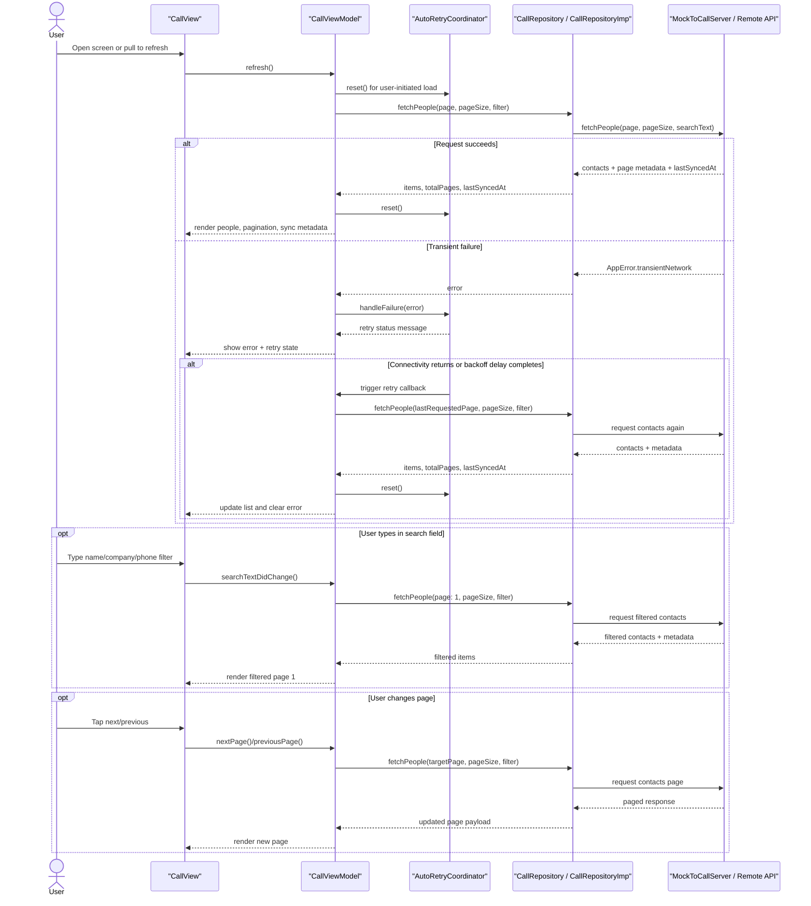

# To Call Module Feature

## Purpose

Display and manage a paginated list of people to call from a remote API.

This document combines both the feature overview and the main design decisions behind the `To Call` implementation.

## Core Features

- Remote API-backed contact list
- Pagination
- Filtering by contact name, company, or phone number
- Retry logic for transient failures
- User-facing retry backoff
- Manual retry button after failures
- Automatic retry when network connectivity returns
- Last-synced timestamp

## Contact Data

Each person to call can include:

- Name
- One or more phone numbers
- Company
- Priority
- Last contacted time
- Notes
- Preferred contact time
- Email

## User Experience

- Load the first page on screen open
- Apply search filters automatically while typing
- Move between previous and next pages
- Show retry status while waiting to retry
- Show sync metadata
- Surface loading and error states

Current active behavior:

- Contacts can be filtered by contact name, company, or phone number
- Search filtering is applied before pagination so page counts stay consistent
- Changing the search text reloads the list from page 1

## Key Decisions

### Remote-first module

`To Call` is implemented as a remote-data feature because the assignment explicitly describes it as a web API-backed module.

This keeps `To Call` aligned with the brief and clearly separate from the local persistence concerns of `To Sell`, wishlist storage, and sync flows.

### MVVM in Presentation

The module uses:

- `CallView`
- `CallViewModel`
- `CallPersonCard`

The view stays focused on rendering and user interaction, while the view model owns loading, filtering, retry, pagination, and error state. Person-specific rendering is extracted into a dedicated component so the main screen stays focused on composition.

### Clean Architecture boundaries

The module is intentionally split across `Presentation`, `Domain`, `Data`, and shared retry/connectivity helpers so that UI does not depend on transport details and the repository contract remains the feature's data boundary.

This also keeps the feature consistent with the broader feature-first structure introduced in the project.

### Pagination and filtering

Pagination is included because it is explicitly required by the assignment, and the page metadata belongs in repository responses and view model state rather than in the view alone.

Filtering currently supports:

- contact name
- company
- phone number

Filtering is applied automatically while typing to keep the flow fast and practical for a call-oriented workflow without adding much UI complexity.

### Multiple phone numbers

`PersonToCall` uses `phoneNumbers: [String]` instead of a single phone number field.

This keeps the entity closer to real-world contact data and leaves the feature flexible for future contact workflows.

### Retry behavior

Retry is exposed through the UI and view model, while the retry state machine itself is handled by the shared `AutoRetryCoordinator`.

This keeps the retry policy reusable and avoids embedding reconnect-aware retry logic directly inside one screen. The current implementation supports transient failure retry, manual retry, user-visible retry status, and immediate retry when connectivity returns.

### Last-synced metadata

The paginated response includes `lastSyncedAt` because the assignment requires last-synced visibility and because freshness is important for a remote list workflow.

### Mock API and no local persistence

The current implementation uses a mock remote server behind a concrete repository because the assignment requires creating a mock API and the provided URLs are only examples.

`To Call` intentionally does not use SQLite or SwiftData. Keeping it remote-first reduces unnecessary complexity and leaves local persistence focused on the features that need it more.

## Architecture Notes

- `Features/CallFeature/Presentation`: SwiftUI screen and view model
- `Features/CallFeature/Presentation/Components`: feature-scoped person card UI
- `Features/CallFeature/Domain/Entities/PersonToCall.swift`: contact entity
- `Features/CallFeature/Domain/Repositories/CallRepository.swift`: repository contract used directly by the view model for paginated contact loading
- `Features/CallFeature/Data/CallRepositoryImp.swift`: app-side repository implementation over the mock call server
- `Features/CallFeature/Data/Remote/MockToCallServer.swift`: mock remote API for contacts, pagination, and transient failures
- `Features/CallFeature/Data/Remote/RemotePersonToCallDTO.swift`: remote contact payload mapped into the domain entity
- `Shared/AutoRetryCoordinator.swift`: shared retry orchestration for transient failures
- `Shared/ConnectivityMonitoring.swift`: connectivity abstraction used by the retry flow

## Diagrams

## Summary

The `To Call` module is designed as a remote, paginated, filterable contact workflow with lightweight MVVM presentation and explicit repository boundaries. The main design goals are to keep the feature aligned with the assignment, keep retry behavior reusable, support realistic contact data, and avoid adding local persistence where it is not needed.
