# To Sell Module Features

## Purpose

Manage the local inventory of items to sell through a dedicated `SellRepository` contract.

The implementation uses a local SQLite table named `ItemToSell`.

This document combines both the feature overview and the main design decisions behind the `To Sell` implementation.

## Core Features

- Local SQLite database storage
- Inventory loading
- Create and update
- Sell a selected amount from inventory
- Single-screen inline editing
- Inline lifecycle status editing
- Validation
- Bulk delete
- Restore deleted items
- Sold-out filtering
- Paged inventory loading
- Automatic next-page loading while scrolling

## Item Data

Each sell item can include:

- Title
- Asking price
- Quantity
- Detail
- Lifecycle status
- Created timestamp
- Updated timestamp

## User Experience

- Load inventory on screen open
- Load inventory page-by-page
- Load the next page automatically as the user scrolls
- Create an item from the inline "Add Item" form
- Edit an existing item inline from the inventory list
- Change an item's lifecycle status inline between active and archived
- Filter inventory by stock state: all, available, sold out
- Pull to refresh the inventory
- Delete multiple selected items through list multi-selection
- Undo recent delete by restoring removed items
- Surface validation, loading, and persistence errors

Current active behavior:

- Inventory is sorted by `updatedAt` descending
- Create, update, delete, and sell actions all persist locally first and enqueue sync work through the same repository boundary
- After a sell change is queued locally, the app waits for a later sync trigger
- The sync target is a shared mock backend inventory record, while sell-specific DTOs and repositories remain feature-owned

## Key Decisions

### Local-first inventory with queued sync

`To Sell` treats local SQLite storage as the source of truth for inventory changes.

Create, update, delete, and sell actions persist locally first and enqueue sync work for later replay instead of making direct network calls from the screen flow.

### Inline editing on a single inventory screen

The feature keeps create, edit, lifecycle updates, sell actions, selection, and undo support close to the main list workflow.

This keeps the assignment flow fast and practical without requiring a separate edit screen for each item.

### Validation-heavy mutations use dedicated use cases

Create, update, and sell flows use explicit use cases because they add validation and clearer business intent.

Simple inventory loading and restore behavior remain repository-driven because those reads and undo-style actions do not need extra orchestration.

### SQLite-backed persistence shared with sync

`SQLite` is the active backend for `To Sell`, and the sync feature continues to use the same underlying local store for queued operation replay.

This keeps the sell and sync flows consistent while preserving feature-specific domain and transport models.

## Architecture Notes

- `Features/SellFeature/Presentation`: SwiftUI screen and view model
- `Features/SellFeature/Domain/Entities/SellItem.swift`: sell item entity
- `Features/SellFeature/Domain/Models/SellInventoryModels.swift`: paged query, filter, sort, and page result types for sell inventory
- `Features/SellFeature/Domain/Repositories/SellRepository.swift`: sell inventory contract for reads, writes, and restore support, used directly by the view model for simple pass-through loading and undo flows
- `Features/SellFeature/Domain/UseCases/CreateSellItemUseCase.swift`: create validation and action
- `Features/SellFeature/Domain/UseCases/SellAmountUseCase.swift`: sell-quantity validation and quantity reduction action
- `Features/SellFeature/Domain/UseCases/UpdateSellItemUseCase.swift`: update validation and action
- `Features/SyncFeature/Domain/Entities/QueuedSellOperation.swift`: queued sell operation model used during sync replay
- `Features/SyncFeature/Domain/Repositories/SyncRepository.swift`: sync queue contract for pending operation reads and replay
- `Features/SellFeature/Data/SellLocalDataSource.swift`: local sell inventory persistence contract used by the repository implementation
- `Features/SellFeature/Data/Local/SQLite/SQLiteSellStore.swift`: actor facade over the focused SQLite collaborators
- `Features/SellFeature/Data/Local/SQLite/SQLiteSellItemStore.swift`: sell-item SQLite queries, filtering, paging, and writes
- `Features/SellFeature/Data/Local/SQLite/SQLitePendingSyncStore.swift`: pending-sync queue storage and payload handling
- `Features/SellFeature/Data/Local/SQLite/SQLiteSchemaManager.swift`: schema creation, migrations, and index setup
- `Features/SellFeature/Data/Local/SQLite/SQLiteDatabase.swift`: low-level SQLite connection, binding, and transaction helpers
- `Features/SellFeature/Data/Local/SQLiteSellLocalDataSource.swift`: local sell inventory data source over the SQLite store, including transactional write-plus-queue operations for create, update, and delete
- `Shared/Infrastructure/Data/Remote/RemoteInventoryItemDTO.swift`: shared backend inventory record used by both `ToBuy` and `ToSell`
- `Shared/Infrastructure/Data/Remote/MockInventoryServer.swift`: shared mock server that stores canonical backend inventory for both BuyFeature and SellFeature
- `Features/SyncFeature/Data/Local/SQLiteSyncLocalDataSource.swift`: local sync queue data source over the shared SQLite store for pending operation reads and removals
- `Features/SyncFeature/Data/SellRemoteGateway.swift`: sync-facing remote sell replay contract used by the repository implementation
- `Features/SyncFeature/Data/Remote/RemoteSellItemDTO.swift`: sync-owned sell payload used when replaying queued sell operations to the backend
- `Features/SyncFeature/Data/Remote/MockSellRemoteGateway.swift`: mock remote implementation of the sync sell replay contract
- `Features/SyncFeature/Data/SyncRepositoryImp.swift`: sync repository that replays queued sell operations through sync-local and remote data sources

## Diagram

```mermaid
sequenceDiagram
    actor User
    participant View as "ToSellView"
    participant VM as "ToSellViewModel"
    participant CreateUC as "CreateSellItemUseCase"
    participant UpdateUC as "UpdateSellItemUseCase"
    participant SellUC as "SellAmountUseCase"
    participant Repo as "SellInventoryReader & SellInventoryWriter / SQLiteSellLocalDataSource"
    participant SQLite as "SQLiteSellStore"

    User->>View: Open screen
    View->>VM: refresh()
    VM->>Repo: fetchItems(page: 1, status, updatedAtDescending)
    Repo->>SQLite: fetchSellItems(query)
    SQLite-->>Repo: first inventory page
    Repo-->>VM: SellItemsPage
    VM-->>View: render inventory list

    opt User changes status filter
        User->>View: Change status filter
        View->>VM: refresh()
        VM->>Repo: fetchItems(page: 1, updated filter)
        Repo-->>VM: filtered inventory page
        VM-->>View: render filtered results
    end

    opt Create item
        User->>View: Submit add item form
        View->>VM: add(title, price, quantity, detail)
        VM->>CreateUC: execute(...)
        CreateUC->>CreateUC: normalize + validate input
        CreateUC->>Repo: create sell item
        Repo->>SQLite: insertSellItemAndQueueCreate(item)
        SQLite->>SQLite: insert sell row + queue create in one transaction
        Repo-->>CreateUC: created item
        CreateUC-->>VM: success
        VM->>Repo: fetchItems(first page with current filter)
        Repo->>SQLite: fetchSellItems(query)
        SQLite-->>Repo: refreshed inventory page
        Repo-->>VM: refreshed inventory page
        VM-->>View: refresh inventory list
    end

    opt Update item inline
        User->>View: Edit inline fields and tap save
        View->>VM: save(updatedItem)
        VM->>UpdateUC: execute(item)
        UpdateUC->>Repo: fetchItem(id)
        Repo->>SQLite: fetchSellItem(id)
        SQLite-->>Repo: existing item
        Repo-->>UpdateUC: existing item
        UpdateUC->>UpdateUC: normalize + validate update
        UpdateUC->>Repo: update sell item
        Repo->>SQLite: updateSellItemAndQueue(item, .update)
        SQLite->>SQLite: update row + queue update in one transaction
        Repo-->>UpdateUC: updated item
        UpdateUC-->>VM: success
        VM->>Repo: fetchItems(first page with current filter)
        Repo->>SQLite: fetchSellItems(query)
        SQLite-->>Repo: refreshed inventory page
        Repo-->>VM: refreshed inventory page
        VM-->>View: refresh inventory list
    end

    opt Sell selected amount
        User->>View: Tap Confirm Sold
        View->>VM: sell(item, amount)
        VM->>SellUC: execute(itemID, amount)
        SellUC->>Repo: fetchItem(id)
        Repo->>SQLite: fetchSellItem(id)
        SQLite-->>Repo: existing item
        Repo-->>SellUC: existing item
        SellUC->>SellUC: validate amount and status
        SellUC->>Repo: update reduced-quantity item
        Repo->>SQLite: updateSellItemAndQueue(item, .update)
        SQLite->>SQLite: update row + queue update in one transaction
        Repo-->>SellUC: updated item
        SellUC-->>VM: success
        VM->>Repo: fetchItems(first page with current filter)
        Repo->>SQLite: fetchSellItems(query)
        SQLite-->>Repo: refreshed inventory page
        Repo-->>VM: refreshed inventory page
        VM-->>View: refresh inventory list
    end

    opt Bulk delete
        User->>View: Select items and confirm delete
        View->>VM: delete(ids)
        VM->>Repo: delete sell items
        Repo->>SQLite: fetchSellItems(ids)
        SQLite-->>Repo: deleted items for undo
        Repo->>SQLite: deleteSellItemsAndQueue(items)
        SQLite->>SQLite: delete rows + queue delete ops in one transaction
        Repo-->>VM: lastDeletedItems
        VM->>Repo: fetchItems(first page with current filter)
        Repo->>SQLite: fetchSellItems(query)
        SQLite-->>Repo: refreshed inventory page
        Repo-->>VM: refreshed inventory page
        VM-->>View: refresh list and show undo action
    end

    opt Undo delete
        User->>View: Tap undo delete
        View->>VM: undoDelete()
        VM->>Repo: restore items
        Repo->>SQLite: upsertSellItems(items)
        SQLite-->>Repo: rows restored locally
        Repo-->>VM: success
        Note over VM,SQLite: Restore does not queue a sync operation
        VM->>Repo: fetchItems(first page with current filter)
        Repo->>SQLite: fetchSellItems(query)
        SQLite-->>Repo: refreshed inventory page
        Repo-->>VM: refreshed inventory page
        VM-->>View: refresh list
    end

    opt User scrolls to the last visible item
        View->>VM: loadNextPageIfNeeded(currentItem)
        VM->>Repo: fetchItems(next page with current filter)
        Repo->>SQLite: fetchSellItems(query)
        SQLite-->>Repo: next inventory page
        Repo-->>VM: next page
        VM-->>View: append more rows
    end
```

## Summary

The `To Sell` module is designed as a local-first SQLite inventory workflow with explicit validation for mutation paths and queued sync for later backend replay. The main design goals are to keep inventory edits responsive, preserve strong local persistence guarantees, and make offline-capable sync behavior explicit rather than implicit.
