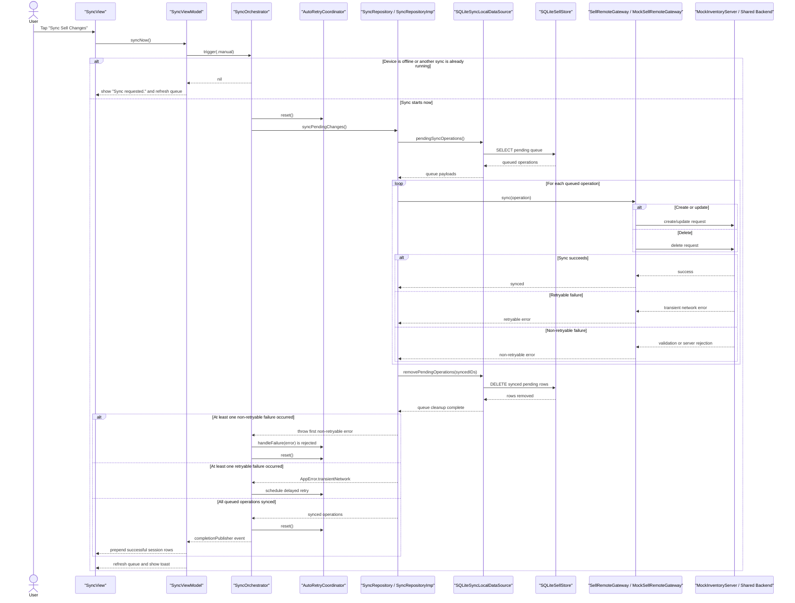
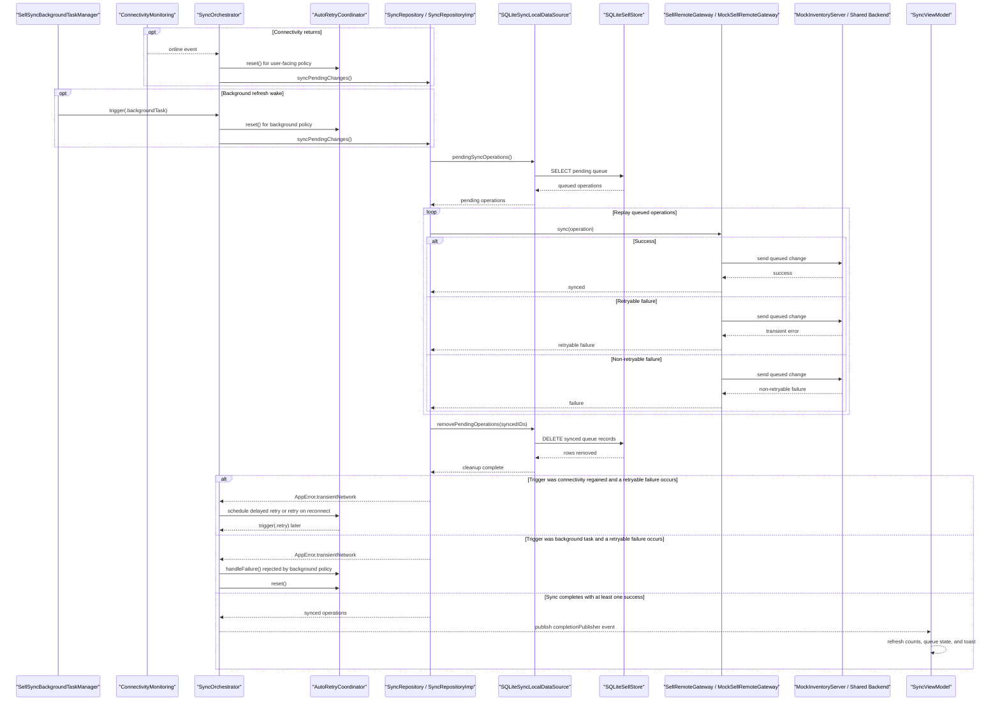

# Sync Module Features

## Purpose

Support offline-first `ToSell` changes by queueing local sell updates and syncing them to an API when connectivity is available.

This document combines both the feature overview and the main design decisions behind the `Sync` implementation.

## Core Features

- Offline-first sell change flow
- Manual sync
- Auto sync on connectivity regain
- Background refresh sync every 15 minutes
- Pending sync queue

## User Experience

- Queue sell changes even while offline
- Attempt sync again when network connectivity returns
- Schedule background refresh every 15 minutes and attempt 1 sync run per refresh
- Show pending sell sync items
- Show successful sync operations for the current app session
- Trigger manual sell sync
- Show loading, success, and error states

## Data

The module works with:

- `SellItem`
- `QueuedSellOperation`

## Key Decisions

### Offline-first queue before network replay

The sync flow starts from locally persisted sell changes rather than from live UI actions.

That keeps `To Sell` responsive while making replay timing explicit and recoverable.

### Feature-owned orchestration for multi-trigger sync

`SyncOrchestrator` owns manual triggers, reconnect triggers, background-task triggers, retry integration, and in-flight deduping.

That logic is broader than a single use case but still specific to sync behavior, so it belongs in the feature-owned `Application` layer.

### Different retry policy for user-facing and background flows

Retry only applies to transient network failures.

User-facing triggers use a fast backoff schedule of 3s, 5s, and 10s with reconnect-aware retry, while background refresh performs one attempt per wake without an in-process retry loop.

### Direct queue-focused Sync screen

The `Sync` screen shows queued sell operations directly and also keeps an in-memory history of successful sync operations for the current app session.

Entering the Sync tab refreshes local state but does not auto-run sync; manual replay stays explicit.

## Architecture Notes

- `Features/SyncFeature/Presentation`: SwiftUI screen and view model
- `Features/SyncFeature/Domain/Entities/QueuedSellOperation.swift`: generalized queued sell operation model for replaying offline-first changes
- `Features/SyncFeature/Domain/Repositories/SyncRepository.swift`: sync-specific contract for pending queue state and replay, used directly by the Sync screen for queue inspection
- `Features/SyncFeature/Application/SyncOrchestrator.swift`: feature-owned sync coordinator that owns trigger intake, connectivity regain handling, in-flight deduping, retry integration, and direct queued-replay calls to the sync repository
- `App/SellSyncBackgroundTaskManager.swift`: background app-refresh registration and scheduling for periodic sell sync attempts
- `Features/SellFeature/Data/Local/SQLiteSellLocalDataSource.swift`: local sell inventory data source backed by SQLite
- `Features/SyncFeature/Data/SyncLocalDataSource.swift`: sync-facing local queue contract used by the sync repository implementation
- `Features/SyncFeature/Data/Local/SQLiteSyncLocalDataSource.swift`: local sync queue data source backed by the shared SQLite sell store
- `Features/SyncFeature/Data/SyncRepositoryImp.swift`: syncs generalized queued sell operations to the shared backend and reports retryable failures upward
- `Features/SellFeature/Data/Local/SQLite/SQLiteSellStore.swift`: stores generalized pending sell sync records
- `Features/SyncFeature/Data/SellRemoteGateway.swift`: sell-specific remote replay contract used by the sync repository implementation
- `Features/SyncFeature/Data/Remote/RemoteSellItemDTO.swift`: sync-owned remote transport model for replaying queued sell operations
- `Features/SyncFeature/Data/Remote/MockSellRemoteGateway.swift`: mock remote sync gateway for sell operations
- `Shared/Infrastructure/Data/Remote/RemoteInventoryItemDTO.swift`: canonical backend inventory record shared by `ToBuy` and `ToSell`
- `Shared/Infrastructure/Data/Remote/MockInventoryServer.swift`: shared mock backend currently referenced by To Buy and To Sell
- `Shared/AutoRetryCoordinator.swift`: retry backoff and reconnect-aware retry policy used by the orchestrator
- `Shared/ConnectivityMonitoring.swift`: connectivity abstraction used by the orchestrator and retry policy

## Diagram

## Summary

The `Sync` module is designed as an offline-first replay system for sell changes rather than as a direct network workflow. The main design goals are to preserve local-first sell behavior, make retry and trigger policies explicit, and keep sync orchestration isolated in a feature-owned coordinator.
